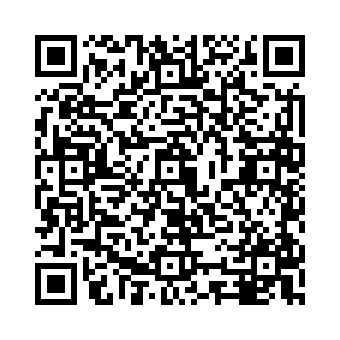

## Descrizione del Progetto

Questo progetto è stato creato per l’Istituto Pantanelli-Monnet di Ostuni con l’idea di aiutare gli studenti a capire meglio cos’è la sostenibilità digitale e perché è importante usare la tecnologia in modo più consapevole.

Il funzionamento è molto semplice: basta scansionare un QR code per accedere ogni giorno a una slide diversa. In ogni slide ci sono informazioni, curiosità e piccoli spunti di riflessione su temi legati al digitale, come l’impatto ambientale di internet, il consumo energetico dei dispositivi, la gestione dei dati e alcuni consigli pratici per ridurre la propria impronta digitale.

Una particolarità del progetto è il modo in cui vengono scelte le slide. Non sono completamente casuali, ma seguono un sistema basato sulla data: questo significa che tutti vedono la stessa slide nello stesso giorno, indipendentemente da quando o da dove accedono. In questo modo diventa anche più facile parlarne insieme in classe e confrontarsi sul contenuto del giorno.

<br>


## Obiettivi
- Promuovere la consapevolezza sulla sostenibilità digitale
- Favorire il micro-learning attraverso contenuti brevi e quotidiani
- Integrare strumenti digitali nella didattica in modo innovativo
- Stimolare la curiosità e l’apprendimento continuo

## Funzionamento
1. Lo studente scansiona il QR code  
2. Viene aperta una pagina web  
3. Uno script JavaScript:
   - Carica il file `links.json`
   - Genera un valore pseudo-casuale basato sulla data
   - Seleziona un link tra quelli disponibili  
4. Infine, l’utente viene reindirizzato automaticamente alla slide del giorno realizzata su Canva

## Logica di Selezione

La selezione del contenuto si basa su un seed giornaliero calcolato come segue:

```js
seed = anno * 1000 + mese * 100 + giorno
````

Questo approccio consente di:

* Ottenere una variazione giornaliera del contenuto
* Mantenere coerenza tra gli utenti nello stesso giorno
* Evitare l’utilizzo di backend o database

## Struttura del Progetto

```
project/
│── index.html
│── links.json
```

### index.html

Contiene la logica principale per:

* Recuperare i link
* Generare il valore pseudo-casuale
* Effettuare il reindirizzamento automatico

### links.json

File contenente l’elenco dei contenuti disponibili:

```json
{
  "links": [
    "https://www.canva.com/design/...",
    "https://www.canva.com/design/...",
    "https://www.canva.com/design/..."
  ]
}
```

## Possibili Estensioni

* Introduzione di categorie tematiche
* Sistema di rotazione avanzato (settimanale o per argomento)
* Integrazione con strumenti didattici
* Raccolta di statistiche di utilizzo

## Tecnologie Utilizzate

* HTML5
* JavaScript (Vanilla)
* JSON

## Contributors

I contributi sono benvenuti, soprattutto per ampliare i contenuti disponibili.

Per contribuire al progetto non è necessario modificare il codice: è sufficiente aggiornare il file `links.json`, aggiungendo nuovi link alle slide Canva che si vogliono includere nella rotazione giornaliera.

### Come contribuire

1. Effettuare un fork del repository
2. Modificare il file `links.json` aggiungendo uno o più link validi
3. Assicurarsi che i link funzionino correttamente
4. Aprire una pull request descrivendo brevemente cosa è stato aggiunto

### Linee guida

* Inserire solo link a contenuti pertinenti alla sostenibilità digitale
* Verificare che i link Canva siano pubblici e accessibili
* Mantenere il file JSON ordinato e ben formattato
* Evitare duplicati o contenuti non rilevanti

### Elenco dei Contributors

- Elia Calabretta

Le modifiche che rispettano queste linee guida potranno essere revisionate e accettate nel progetto.

## Licenza

Questo progetto è rilasciato per scopi educativi. È possibile riutilizzarlo e adattarlo in contesti scolastici.